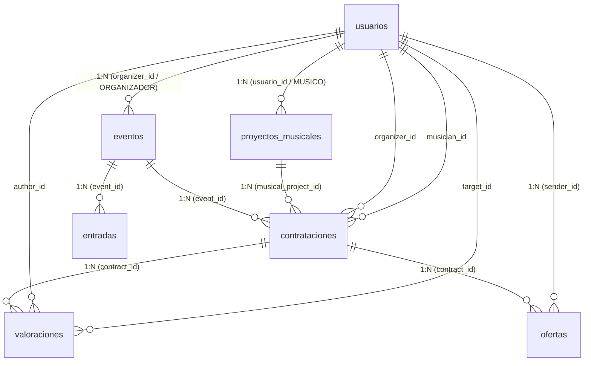

# Documentación de Base de Datos — Arma tu pogo

## 1. Descripción

Este documento describe la arquitectura de la base de datos relacional PostgreSQL para **Arma tu pogo**, modelada mediante **Prisma ORM** y alojada en la infraestructura administrada de PostgreSQL, implementada según `docs/spec.md` y `AGENTS.md`.

El esquema declarativo y las relaciones de la base de datos se gestionan a través de:
* `prisma/schema.prisma` (definición de modelos, enums, índices y relaciones en español)
* `lib/prisma.ts` (cliente singleton de Prisma para Next.js App Router)

---

## 2. Diagrama Entidad-Relación y Tablas



---

## 3. Especificación Detallada de Tablas y Modelos

### 3.1 `usuarios` (Modelo Prisma: `Usuario`)
Almacena el perfil del usuario autenticado, su rol en el sistema y datos de contacto.

| Columna | Tipo | Constraints / Default | Descripción |
|---|---|---|---|
| `id` | `UUID` | `PRIMARY KEY` | ID de usuario |
| `email` | `TEXT` | `NOT NULL, UNIQUE` | Correo electrónico |
| `first_name` | `TEXT` | `NOT NULL` | Nombre |
| `last_name` | `TEXT` | `NOT NULL` | Apellido |
| `role` | `TEXT` | `NOT NULL, RolUsuario (MUSICO, ORGANIZADOR)` | Rol del usuario |
| `avatar_url` | `TEXT` | `NULL` | Imagen de perfil |
| `bio` | `TEXT` | `NULL` | Biografía |
| `phone` | `TEXT` | `NULL` | Teléfono de contacto |
| `created_at` | `TIMESTAMPTZ` | `NOT NULL, DEFAULT NOW()` | Fecha de creación |
| `updated_at` | `TIMESTAMPTZ` | `NOT NULL, DEFAULT NOW()` | Fecha de actualización |

---

### 3.2 `proyectos_musicales` (Modelo Prisma: `ProyectoMusical`)
Representa bandas, solistas o propuestas artísticas registradas y administradas por un músico.

| Columna | Tipo | Constraints / Default | Descripción |
|---|---|---|---|
| `id` | `UUID` | `PRIMARY KEY, DEFAULT gen_random_uuid()` | Identificador del proyecto |
| `user_id` | `UUID` | `NOT NULL, REFERENCES usuarios(id) ON DELETE CASCADE` | ID del músico propietario |
| `name` | `TEXT` | `NOT NULL` | Nombre artístico |
| `description` | `TEXT` | `NULL` | Descripción y propuesta musical |
| `genre` | `TEXT` | `NOT NULL` | Género musical |
| `approximate_cache` | `NUMERIC(12, 2)` | `CHECK (approximate_cache >= 0)` | Caché orientativo de referencia |
| `location` | `TEXT` | `NULL` | Ubicación / Localidad |
| `city` | `TEXT` | `NULL` | Ciudad |
| `image_url` | `TEXT` | `NULL` | Foto del proyecto |
| `spotify_url` | `TEXT` | `NULL` | Enlace a Spotify |
| `youtube_url` | `TEXT` | `NULL` | Enlace a YouTube |
| `instagram_url` | `TEXT` | `NULL` | Enlace a Instagram |
| `website_url` | `TEXT` | `NULL` | Sitio web o Linktree |
| `custom_links` | `JSONB` | `DEFAULT '[]'::jsonb` | Otros enlaces externos |
| `is_active` | `BOOLEAN` | `NOT NULL, DEFAULT TRUE` | Estado activo/inactivo |
| `created_at` | `TIMESTAMPTZ` | `NOT NULL, DEFAULT NOW()` | Fecha de creación |
| `updated_at` | `TIMESTAMPTZ` | `NOT NULL, DEFAULT NOW()` | Fecha de actualización |

---

### 3.3 `eventos` (Modelo Prisma: `Evento`)
Recitales o fechas publicados por un organizador.

| Columna | Tipo | Constraints / Default | Descripción |
|---|---|---|---|
| `id` | `UUID` | `PRIMARY KEY, DEFAULT gen_random_uuid()` | Identificador del evento |
| `organizer_id` | `UUID` | `NOT NULL, REFERENCES usuarios(id) ON DELETE CASCADE` | ID del organizador |
| `title` | `TEXT` | `NOT NULL` | Nombre del recital / fecha |
| `description` | `TEXT` | `NULL` | Descripción del evento |
| `event_date` | `TIMESTAMPTZ` | `NOT NULL` | Fecha y hora de realización |
| `location` | `TEXT` | `NOT NULL` | Dirección / Lugar |
| `venue_name` | `TEXT` | `NULL` | Nombre del recinto o club |
| `city` | `TEXT` | `NULL` | Ciudad |
| `required_musicians_count` | `INTEGER` | `NOT NULL, DEFAULT 1, CHECK (> 0)` | Cupos de bandas requeridos |
| `offered_cache` | `NUMERIC(12, 2)` | `CHECK (offered_cache >= 0)` | Caché ofrecido orientativo |
| `status` | `TEXT` | `NOT NULL, DEFAULT 'PUBLICADO'` | Estado del evento (`EstadoEvento`) |
| `banner_url` | `TEXT` | `NULL` | Imagen / Banner del evento |
| `created_at` | `TIMESTAMPTZ` | `NOT NULL, DEFAULT NOW()` | Fecha de creación |
| `updated_at` | `TIMESTAMPTZ` | `NOT NULL, DEFAULT NOW()` | Fecha de actualización |

---

### 3.4 `contrataciones` (Modelo Prisma: `Contratacion`)
Representa el proceso de postulación, selección y acuerdo entre un evento y un proyecto musical.

| Columna | Tipo | Constraints / Default | Descripción |
|---|---|---|---|
| `id` | `UUID` | `PRIMARY KEY, DEFAULT gen_random_uuid()` | Identificador de contratación |
| `event_id` | `UUID` | `NOT NULL, REFERENCES eventos(id) ON DELETE CASCADE` | Evento asociado |
| `musical_project_id` | `UUID` | `NOT NULL, REFERENCES proyectos_musicales(id) ON DELETE RESTRICT` | Proyecto musical |
| `organizer_id` | `UUID` | `NOT NULL, REFERENCES usuarios(id) ON DELETE RESTRICT` | Organizador |
| `musician_id` | `UUID` | `NOT NULL, REFERENCES usuarios(id) ON DELETE RESTRICT` | Músico |
| `status` | `TEXT` | `NOT NULL, DEFAULT 'PENDIENTE'` | Estado de la contratación (`EstadoContratacion`) |
| `agreed_amount` | `NUMERIC(12, 2)` | `CHECK (agreed_amount >= 0)` | Monto definitivo acordado |
| `agreed_at` | `TIMESTAMPTZ` | `NULL` | Fecha/hora del acuerdo |
| `cancelled_at` | `TIMESTAMPTZ` | `NULL` | Fecha de cancelación |
| `cancellation_reason` | `TEXT` | `NULL` | Motivo de cancelación |
| `created_by` | `UUID` | `NOT NULL, REFERENCES usuarios(id)` | Quién inició el contacto |
| `created_at` | `TIMESTAMPTZ` | `NOT NULL, DEFAULT NOW()` | Fecha de postulación/creación |
| `updated_at` | `TIMESTAMPTZ` | `NOT NULL, DEFAULT NOW()` | Fecha de actualización |

---

### 3.5 `ofertas` (Modelo Prisma: `Oferta`)
Historial completo de propuestas económicas realizadas durante una negociación.

| Columna | Tipo | Constraints / Default | Descripción |
|---|---|---|---|
| `id` | `UUID` | `PRIMARY KEY, DEFAULT gen_random_uuid()` | Identificador de la oferta |
| `contract_id` | `UUID` | `NOT NULL, REFERENCES contrataciones(id) ON DELETE CASCADE` | Contratación asociada |
| `sender_id` | `UUID` | `NOT NULL, REFERENCES usuarios(id) ON DELETE RESTRICT` | Usuario que propone |
| `amount` | `NUMERIC(12, 2)` | `NOT NULL, CHECK (amount >= 0)` | Monto propuesto |
| `message` | `TEXT` | `NULL` | Mensaje o condiciones |
| `status` | `TEXT` | `NOT NULL, DEFAULT 'PROPUESTA'` | Estado de la oferta (`EstadoOferta`) |
| `created_at` | `TIMESTAMPTZ` | `NOT NULL, DEFAULT NOW()` | Fecha de la oferta |
| `updated_at` | `TIMESTAMPTZ` | `NOT NULL, DEFAULT NOW()` | Fecha de actualización |

---

### 3.6 `valoraciones` (Modelo Prisma: `Valoracion`)
Evaluaciones mutuas post-evento entre las partes involucradas.

| Columna | Tipo | Constraints / Default | Descripción |
|---|---|---|---|
| `id` | `UUID` | `PRIMARY KEY, DEFAULT gen_random_uuid()` | Identificador de la valoración |
| `contract_id` | `UUID` | `NOT NULL, REFERENCES contrataciones(id) ON DELETE CASCADE` | Contratación de respaldo |
| `author_id` | `UUID` | `NOT NULL, REFERENCES usuarios(id) ON DELETE RESTRICT` | Quien califica |
| `target_id` | `UUID` | `NOT NULL, REFERENCES usuarios(id) ON DELETE RESTRICT` | Quien recibe la calificación |
| `target_project_id` | `UUID` | `NULL, REFERENCES proyectos_musicales(id) ON DELETE SET NULL` | Proyecto calificado si aplica |
| `score` | `INTEGER` | `NOT NULL, CHECK (score >= 1 AND score <= 5)` | Puntaje de 1 a 5 estrellas |
| `comment` | `TEXT` | `NULL` | Comentario / Reseña |
| `created_at` | `TIMESTAMPTZ` | `NOT NULL, DEFAULT NOW()` | Fecha de valoración |
| `updated_at` | `TIMESTAMPTZ` | `NOT NULL, DEFAULT NOW()` | Fecha de actualización |

---

### 3.7 `entradas` (Modelo Prisma: `Entrada`)
Información pública y conceptual sobre entradas de eventos (alcance MVP).

| Columna | Tipo | Constraints / Default | Descripción |
|---|---|---|---|
| `id` | `UUID` | `PRIMARY KEY, DEFAULT gen_random_uuid()` | Identificador de tipo de entrada |
| `event_id` | `UUID` | `NOT NULL, REFERENCES eventos(id) ON DELETE CASCADE` | Evento asociado |
| `ticket_type` | `TEXT` | `NOT NULL, DEFAULT 'GENERAL'` | Tipo (GENERAL, VIP, etc.) |
| `price` | `NUMERIC(12, 2)` | `NOT NULL, DEFAULT 0, CHECK (price >= 0)` | Precio informativo |
| `capacity` | `INTEGER` | `CHECK (capacity > 0)` | Capacidad o cupo |
| `description` | `TEXT` | `NULL` | Detalles de la entrada |
| `external_purchase_url` | `TEXT` | `NULL` | Link externo para compra si existe |
| `is_free` | `BOOLEAN` | `NOT NULL, DEFAULT FALSE` | Si es entrada gratuita |
| `created_at` | `TIMESTAMPTZ` | `NOT NULL, DEFAULT NOW()` | Fecha de creación |
| `updated_at` | `TIMESTAMPTZ` | `NOT NULL, DEFAULT NOW()` | Fecha de actualización |

---

## 4. Gestión del Schema y Migraciones con Prisma

### Comandos frecuentes:

* **Generar cliente de TypeScript:**
  ```bash
  npx prisma generate
  ```

* **Sincronizar esquema directamente con la base de datos (desarrollo):**
  ```bash
  npx prisma db push
  ```

* **Explorar la base de datos visualmente (Prisma Studio):**
  ```bash
  npx prisma studio
  ```