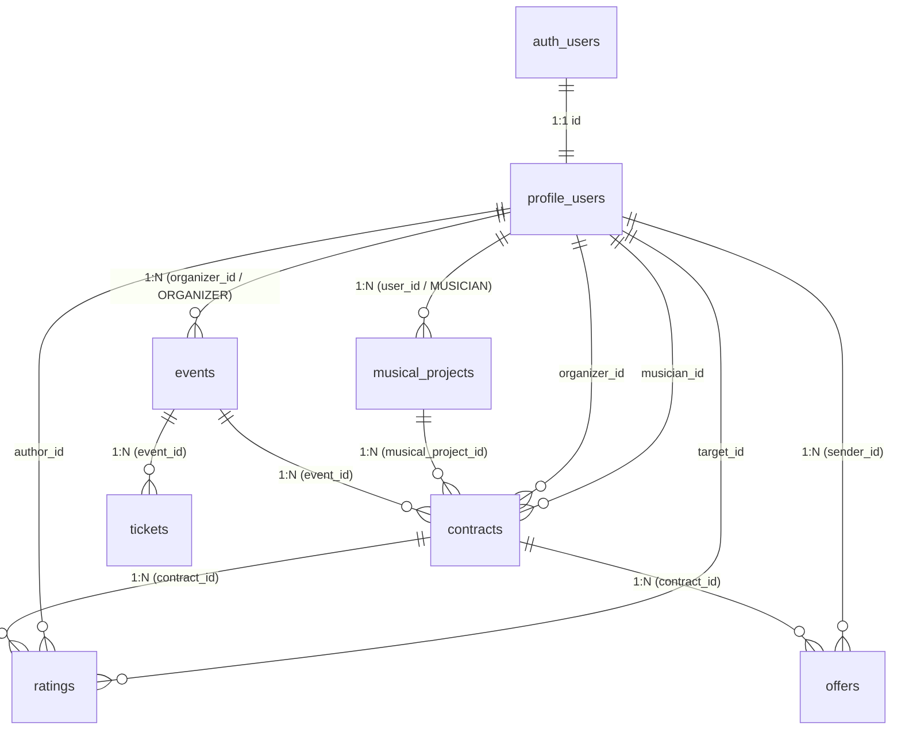

# Documentación de Base de Datos — Backstage

## 1. Descripción

Este documento describe la arquitectura de la base de datos relacional PostgreSQL en Supabase para **Backstage**, implementada según `docs/spec.md` y `AGENTS.md`.

Todas las migraciones se gestionan de forma reproducible a través de archivos SQL en la carpeta:
`supabase/migrations/`

---

## 2. Diagrama Entidad-Relación y Tablas

---

## 3. Especificación Detallada de Tablas

### 3.1 `profile_users` (Perfiles de Usuario)
Extiende la tabla nativa `auth.users` de Supabase para almacenar el rol y datos de perfil.

| Columna | Tipo | Constraints / Default | Descripción |
|---|---|---|---|
| `id` | `UUID` | `PRIMARY KEY, REFERENCES auth.users(id) ON DELETE CASCADE` | ID de usuario |
| `email` | `TEXT` | `NOT NULL, UNIQUE` | Correo electrónico |
| `first_name` | `TEXT` | `NOT NULL` | Nombre |
| `last_name` | `TEXT` | `NOT NULL` | Apellido |
| `role` | `TEXT` | `NOT NULL, CHECK (role IN ('MUSICIAN', 'ORGANIZER'))` | Rol único en el MVP |
| `avatar_url` | `TEXT` | `NULL` | Imagen de perfil |
| `bio` | `TEXT` | `NULL` | Biografía |
| `phone` | `TEXT` | `NULL` | Teléfono de contacto |
| `created_at` | `TIMESTAMPTZ` | `NOT NULL, DEFAULT NOW()` | Fecha de creación |
| `updated_at` | `TIMESTAMPTZ` | `NOT NULL, DEFAULT NOW()` | Fecha de actualización |

* **Índices**: `idx_profile_users_email`, `idx_profile_users_role`
* **Triggers**: `trigger_profile_users_updated_at` (actualiza `updated_at`)

---

### 3.2 `musical_projects` (Proyectos Musicales)
Representa bandas, solistas o propuestas artísticas registradas y administradas por un músico.

| Columna | Tipo | Constraints / Default | Descripción |
|---|---|---|---|
| `id` | `UUID` | `PRIMARY KEY, DEFAULT gen_random_uuid()` | Identificador del proyecto |
| `user_id` | `UUID` | `NOT NULL, REFERENCES profile_users(id) ON DELETE CASCADE` | ID del músico propietario |
| `name` | `TEXT` | `NOT NULL` | Nombre artístico |
| `description` | `TEXT` | `NULL` | Descripción y propuesta musical |
| `genre` | `TEXT` | `NOT NULL` | Género musical |
| `approximate_cache` | `NUMERIC(12, 2)` | `CHECK (approximate_cache >= 0)` | Caché orientativo de referencia |
| `location` | `TEXT` | `NULL` | Ubicación / Localidad |
| `city` | `TEXT` | `NULL` | Ciudad |
| `image_url` | `TEXT` | `NULL` | Foto del proyecto |
| `spotify_url` | `TEXT` | `NULL` | Enlace a Spotify |
| `youtube_url` | `TEXT` | `NULL` | Enlace a YouTube |
| `instagram_url` | `TEXT` | `NULL` | Enlace a Instagram |
| `website_url` | `TEXT` | `NULL` | Sitio web o Linktree |
| `custom_links` | `JSONB` | `DEFAULT '[]'::jsonb` | Otros enlaces externos |
| `is_active` | `BOOLEAN` | `NOT NULL, DEFAULT TRUE` | Estado activo/inactivo |
| `created_at` | `TIMESTAMPTZ` | `NOT NULL, DEFAULT NOW()` | Fecha de creación |
| `updated_at` | `TIMESTAMPTZ` | `NOT NULL, DEFAULT NOW()` | Fecha de actualización |

* **Índices**: `idx_musical_projects_user_id`, `idx_musical_projects_genre`, `idx_musical_projects_is_active`
* **Triggers**:
  * `trigger_musical_projects_check_musician`: valida que el propietario tenga rol `MUSICIAN`.
  * `trigger_musical_projects_updated_at`: actualiza `updated_at`.

---

### 3.3 `events` (Eventos)
Recitales o fechas publicados por un organizador.

| Columna | Tipo | Constraints / Default | Descripción |
|---|---|---|---|
| `id` | `UUID` | `PRIMARY KEY, DEFAULT gen_random_uuid()` | Identificador del evento |
| `organizer_id` | `UUID` | `NOT NULL, REFERENCES profile_users(id) ON DELETE CASCADE` | ID del organizador |
| `title` | `TEXT` | `NOT NULL` | Nombre del recital / fecha |
| `description` | `TEXT` | `NULL` | Descripción del evento |
| `event_date` | `TIMESTAMPTZ` | `NOT NULL` | Fecha y hora de realización |
| `location` | `TEXT` | `NOT NULL` | Dirección / Lugar |
| `venue_name` | `TEXT` | `NULL` | Nombre del recinto o club |
| `city` | `TEXT` | `NULL` | Ciudad |
| `required_musicians_count` | `INTEGER` | `NOT NULL, DEFAULT 1, CHECK (> 0)` | Cupos de bandas requeridos |
| `offered_cache` | `NUMERIC(12, 2)` | `CHECK (offered_cache >= 0)` | Caché ofrecido orientativo |
| `status` | `TEXT` | `NOT NULL, DEFAULT 'PUBLISHED', CHECK (status IN ('DRAFT', 'PUBLISHED', 'IN_PROGRESS', 'COMPLETED', 'CANCELLED'))` | Estado del evento |
| `banner_url` | `TEXT` | `NULL` | Imagen / Banner del evento |
| `created_at` | `TIMESTAMPTZ` | `NOT NULL, DEFAULT NOW()` | Fecha de creación |
| `updated_at` | `TIMESTAMPTZ` | `NOT NULL, DEFAULT NOW()` | Fecha de actualización |

* **Índices**: `idx_events_organizer_id`, `idx_events_status`, `idx_events_event_date`
* **Triggers**:
  * `trigger_events_check_organizer`: valida que el creador tenga rol `ORGANIZER`.
  * `trigger_events_updated_at`: actualiza `updated_at`.

---

### 3.4 `contracts` (Contrataciones)
Representa el proceso de postulación, selección y acuerdo entre un evento y un proyecto musical.

| Columna | Tipo | Constraints / Default | Descripción |
|---|---|---|---|
| `id` | `UUID` | `PRIMARY KEY, DEFAULT gen_random_uuid()` | Identificador de contratación |
| `event_id` | `UUID` | `NOT NULL, REFERENCES events(id) ON DELETE CASCADE` | Evento asociado |
| `musical_project_id` | `UUID` | `NOT NULL, REFERENCES musical_projects(id) ON DELETE RESTRICT` | Proyecto musical |
| `organizer_id` | `UUID` | `NOT NULL, REFERENCES profile_users(id) ON DELETE RESTRICT` | Organizador |
| `musician_id` | `UUID` | `NOT NULL, REFERENCES profile_users(id) ON DELETE RESTRICT` | Músico |
| `status` | `TEXT` | `NOT NULL, DEFAULT 'PENDING', CHECK (status IN ('PENDING', 'NEGOTIATING', 'AGREED', 'CANCELLED', 'COMPLETED', 'REJECTED'))` | Estado de la contratación |
| `agreed_amount` | `NUMERIC(12, 2)` | `CHECK (agreed_amount >= 0)` | Monto definitivo acordado |
| `agreed_at` | `TIMESTAMPTZ` | `NULL` | Fecha/hora del acuerdo |
| `cancelled_at` | `TIMESTAMPTZ` | `NULL` | Fecha de cancelación |
| `cancellation_reason` | `TEXT` | `NULL` | Motivo de cancelación |
| `created_by` | `UUID` | `NOT NULL, REFERENCES profile_users(id)` | Quién inició el contacto |
| `created_at` | `TIMESTAMPTZ` | `NOT NULL, DEFAULT NOW()` | Fecha de postulación/creación |
| `updated_at` | `TIMESTAMPTZ` | `NOT NULL, DEFAULT NOW()` | Fecha de actualización |

* **Constraints**:
  * `uq_contracts_event_project`: `UNIQUE (event_id, musical_project_id)` impide postulaciones duplicadas del mismo proyecto para el mismo evento.
  * `chk_contracts_agreed_fields`: asegura que un contrato `AGREED` tenga `agreed_amount` y `agreed_at` obligatorios.
* **Índices**: `idx_contracts_event_id`, `idx_contracts_musical_project_id`, `idx_contracts_organizer_id`, `idx_contracts_musician_id`, `idx_contracts_status`
* **Triggers**:
  * `trigger_contracts_validate_participants`: asegura que `organizer_id` corresponda al evento, `musician_id` corresponda al dueño del proyecto, y `created_by` sea una de las partes.

---

### 3.5 `offers` (Ofertas y Contraofertas)
Historial completo de propuestas económicas realizadas durante una negociación.

| Columna | Tipo | Constraints / Default | Descripción |
|---|---|---|---|
| `id` | `UUID` | `PRIMARY KEY, DEFAULT gen_random_uuid()` | Identificador de la oferta |
| `contract_id` | `UUID` | `NOT NULL, REFERENCES contracts(id) ON DELETE CASCADE` | Contratación asociada |
| `sender_id` | `UUID` | `NOT NULL, REFERENCES profile_users(id) ON DELETE RESTRICT` | Usuario que propone |
| `amount` | `NUMERIC(12, 2)` | `NOT NULL, CHECK (amount >= 0)` | Monto propuesto |
| `message` | `TEXT` | `NULL` | Mensaje o condiciones |
| `status` | `TEXT` | `NOT NULL, DEFAULT 'PROPOSED', CHECK (status IN ('PROPOSED', 'ACCEPTED', 'REJECTED', 'COUNTERED'))` | Estado de la oferta |
| `created_at` | `TIMESTAMPTZ` | `NOT NULL, DEFAULT NOW()` | Fecha de la oferta |
| `updated_at` | `TIMESTAMPTZ` | `NOT NULL, DEFAULT NOW()` | Fecha de actualización |

* **Índices**: `idx_offers_contract_id`, `idx_offers_sender_id`, `idx_offers_status`, `idx_offers_created_at`
* **Triggers**:
  * `trigger_offers_validate`:
    1. Verifica que `sender_id` sea participante de la contratación.
    2. Impide ofertas si el contrato está en `AGREED`, `CANCELLED`, `COMPLETED` o `REJECTED`.
    3. Al insertar una nueva propuesta, marca la anterior en `PROPOSED` como `COUNTERED` y actualiza el contrato a `NEGOTIATING`.
    4. Al aceptar una propuesta (`ACCEPTED`), actualiza el contrato a `AGREED` con `agreed_amount = offer.amount` y `agreed_at = NOW()`.

---

### 3.6 `ratings` (Valoraciones)
Evaluaciones mutuas post-evento entre las partes involucradas.

| Columna | Tipo | Constraints / Default | Descripción |
|---|---|---|---|
| `id` | `UUID` | `PRIMARY KEY, DEFAULT gen_random_uuid()` | Identificador de la valoración |
| `contract_id` | `UUID` | `NOT NULL, REFERENCES contracts(id) ON DELETE CASCADE` | Contratación de respaldo |
| `author_id` | `UUID` | `NOT NULL, REFERENCES profile_users(id) ON DELETE RESTRICT` | Quien califica |
| `target_id` | `UUID` | `NOT NULL, REFERENCES profile_users(id) ON DELETE RESTRICT` | Quien recibe la calificación |
| `target_project_id` | `UUID` | `NULL, REFERENCES musical_projects(id) ON DELETE SET NULL` | Proyecto calificado si aplica |
| `score` | `INTEGER` | `NOT NULL, CHECK (score >= 1 AND score <= 5)` | Puntaje de 1 a 5 estrellas |
| `comment` | `TEXT` | `NULL` | Comentario / Reseña |
| `created_at` | `TIMESTAMPTZ` | `NOT NULL, DEFAULT NOW()` | Fecha de valoración |
| `updated_at` | `TIMESTAMPTZ` | `NOT NULL, DEFAULT NOW()` | Fecha de actualización |

* **Constraints**:
  * `uq_ratings_contract_author`: `UNIQUE (contract_id, author_id)` asegura que una parte no califique más de una vez la misma contratación.
  * `chk_ratings_author_not_target`: `CHECK (author_id <> target_id)` prohíbe la auto-calificación.
* **Triggers**:
  * `trigger_ratings_validate`:
    1. Exige que el contrato esté en estado `AGREED` o `COMPLETED`.
    2. Valida que el autor sea participante (`organizer_id` o `musician_id`) y el receptor sea la contraparte.

---

### 3.7 `tickets` (Entradas - Alcance Conceptual MVP)
Información pública y conceptual sobre entradas de eventos. No procesa pagos reales dentro del MVP.

| Columna | Tipo | Constraints / Default | Descripción |
|---|---|---|---|
| `id` | `UUID` | `PRIMARY KEY, DEFAULT gen_random_uuid()` | Identificador de tipo de entrada |
| `event_id` | `UUID` | `NOT NULL, REFERENCES events(id) ON DELETE CASCADE` | Evento asociado |
| `ticket_type` | `TEXT` | `NOT NULL, DEFAULT 'GENERAL'` | Tipo (GENERAL, VIP, etc.) |
| `price` | `NUMERIC(12, 2)` | `NOT NULL, DEFAULT 0, CHECK (price >= 0)` | Precio informativo |
| `capacity` | `INTEGER` | `CHECK (capacity > 0)` | Capacidad o cupo |
| `description` | `TEXT` | `NULL` | Detalles de la entrada |
| `external_purchase_url` | `TEXT` | `NULL` | Link externo para compra si existe |
| `is_free` | `BOOLEAN` | `NOT NULL, DEFAULT FALSE` | Si es entrada gratuita |
| `created_at` | `TIMESTAMPTZ` | `NOT NULL, DEFAULT NOW()` | Fecha de creación |
| `updated_at` | `TIMESTAMPTZ` | `NOT NULL, DEFAULT NOW()` | Fecha de actualización |

---

## 4. Políticas de Row Level Security (RLS)

| Tabla | Operación | Rol / Condición |
|---|---|---|
| `profile_users` | `SELECT` | Público / Todos (`true`) |
| `profile_users` | `INSERT / UPDATE / DELETE` | Propietario (`auth.uid() = id`) |
| `musical_projects` | `SELECT` | Público si `is_active = true` O Propietario (`user_id = auth.uid()`) |
| `musical_projects` | `INSERT` | Músico autenticado propietario (`user_id = auth.uid()` con rol `MUSICIAN`) |
| `musical_projects` | `UPDATE / DELETE` | Propietario del proyecto (`user_id = auth.uid()`) |
| `events` | `SELECT` | Público si `status IN ('PUBLISHED', 'IN_PROGRESS', 'COMPLETED')` O Propietario (`organizer_id = auth.uid()`) |
| `events` | `INSERT` | Organizador autenticado (`organizer_id = auth.uid()` con rol `ORGANIZER`) |
| `events` | `UPDATE / DELETE` | Organizador dueño del evento (`organizer_id = auth.uid()`) |
| `contracts` | `SELECT` | Participantes (`organizer_id = auth.uid() OR musician_id = auth.uid()`) |
| `contracts` | `INSERT` | Participante creador (`(organizer_id = auth.uid() OR musician_id = auth.uid()) AND created_by = auth.uid()`) |
| `contracts` | `UPDATE` | Participantes (`organizer_id = auth.uid() OR musician_id = auth.uid()`) |
| `offers` | `SELECT` | Participantes del contrato asociado |
| `offers` | `INSERT` | Participante remitente (`sender_id = auth.uid()`) en contrato `PENDING` o `NEGOTIATING` |
| `offers` | `UPDATE` | Participantes del contrato |
| `offers` | `DELETE` | Denegado (`false`, preservación de historial) |
| `ratings` | `SELECT` | Público / Todos (`true`) |
| `ratings` | `INSERT` | Participante de contrato `AGREED`/`COMPLETED` con `author_id = auth.uid()` |
| `ratings` | `UPDATE / DELETE` | Autor de la valoración (`author_id = auth.uid()`) |
| `tickets` | `SELECT` | Público para eventos publicados o propietario |
| `tickets` | `ALL` | Organizador dueño del evento |

---

## 5. Instrucciones de Ejecución de Migraciones

1. Conectarse a Supabase CLI o al SQL Editor del dashboard del proyecto Supabase.
2. Ejecutar el contenido del archivo:
   `supabase/migrations/00001_initial_schema.sql`
3. Verificar que todas las tablas, índices, triggers y políticas RLS se hayan creado sin errores.
